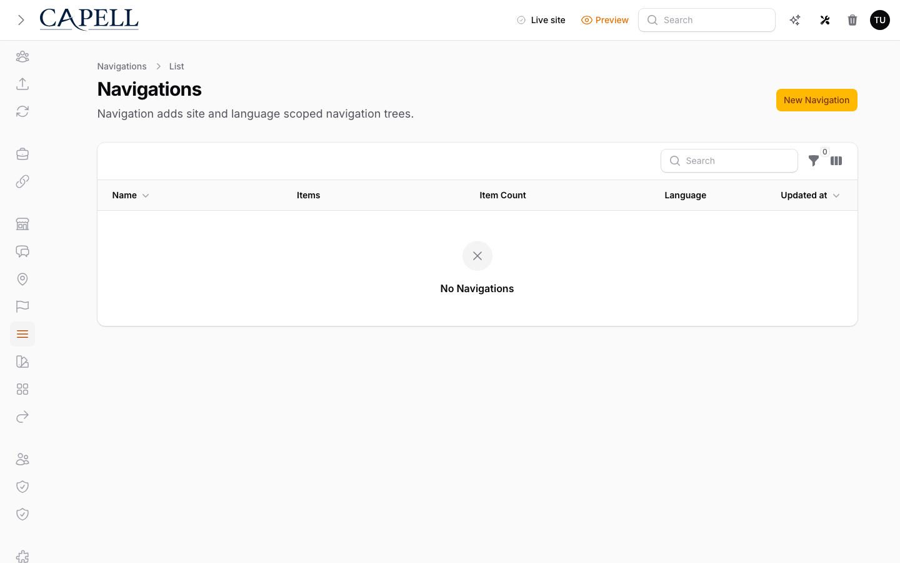
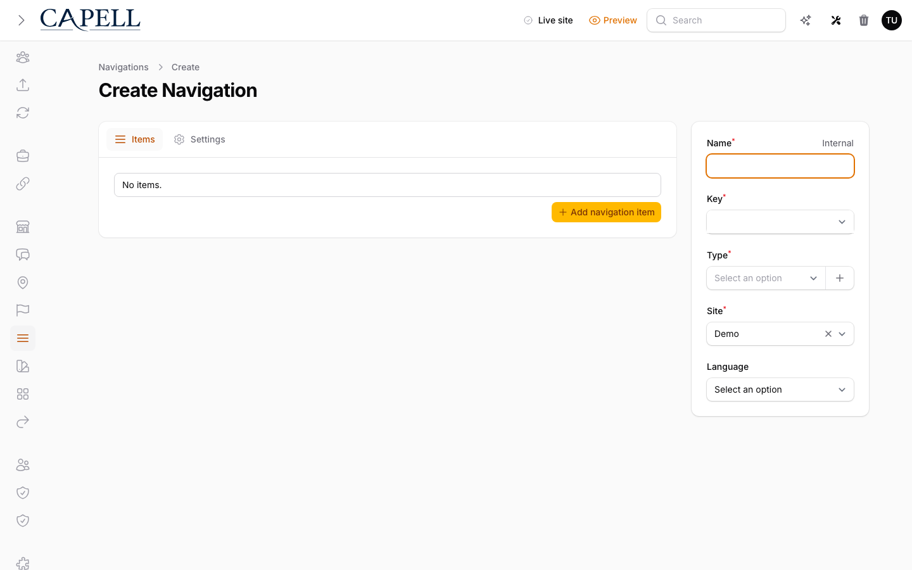

# Navigation

<!-- prettier-ignore-start -->

## What This Plugin Adds

Navigation is an **Available**, **Schema-owning** Capell package in the **Capell Foundation** product group. It ships as `capell-app/navigation` and extends these surfaces: admin, frontend, console.

Navigation adds site- and language-scoped menus with page links, external links, nested items, publication state, and reusable handles.

Editors build and order menus in admin, and public themes receive hydrated navigation with safe URLs, active states, and nested children.

Evidence: [`src/Providers/NavigationServiceProvider.php`](src/Providers/NavigationServiceProvider.php), [`src/Actions/AddPageToNavigationAction.php`](src/Actions/AddPageToNavigationAction.php), [`src/Support/Registry/NavigationHandleRegistry.php`](src/Support/Registry/NavigationHandleRegistry.php), [`tests/Feature/Filament/Resources/Navigation/NavigationResourceTest.php`](tests/Feature/Filament/Resources/Navigation/NavigationResourceTest.php), [`src/Actions/BuildNavigationRenderModelAction.php`](src/Actions/BuildNavigationRenderModelAction.php), [`src/Support/SafeUrl.php`](src/Support/SafeUrl.php), [`tests/Feature/Components/NavigationMenuTest.php`](tests/Feature/Components/NavigationMenuTest.php), [`tests/Feature/Components/NavigationMenuSafeUrlTest.php`](tests/Feature/Components/NavigationMenuSafeUrlTest.php).

Status details:

- Status: Available
- Tier: free
- Bundle: foundation
- Composer package: `capell-app/navigation`
- Namespace: `Capell\Navigation`
- Theme key: not applicable

## Why It Matters

**For developers:** The navigable and handle registries let packages contribute linkable records and named menus without reaching into Navigation internals.

**For teams:** Editors can keep site menus current, reorder links, and reuse the same menu structure across theme output without code changes.

Evidence: [`src/Support/Registry/NavigableRegistry.php`](src/Support/Registry/NavigableRegistry.php), [`src/Support/Registry/NavigationHandleRegistry.php`](src/Support/Registry/NavigationHandleRegistry.php), [`src/Contracts/NavigationNamesResolver.php`](src/Contracts/NavigationNamesResolver.php), [`tests/Integration/Actions/BuildNavigationRenderModelActionTest.php`](tests/Integration/Actions/BuildNavigationRenderModelActionTest.php), [`docs/overview.admin.md`](docs/overview.admin.md), [`src/Actions/RemovePageFromNavigationAction.php`](src/Actions/RemovePageFromNavigationAction.php), [`src/Actions/SyncNavigationPageReferencesAction.php`](src/Actions/SyncNavigationPageReferencesAction.php).

## Screens And Workflow

Screenshot contract: `docs/screenshots.json`.

- Navigation admin index (admin, required).
- Create/edit navigation form (admin, required).
- Site relation manager for navigations (admin, optional).
- Page form navigation tab (admin, required).
- Frontend menu output (frontend, optional).

## Technical Shape

- Service providers: `Capell\Navigation\Providers\NavigationServiceProvider`.
- Migrations: `packages/navigation/database/migrations/2026_05_10_190860_01_create_navigations_table.php`, `packages/navigation/database/migrations/2026_06_04_000001_create_navigation_page_references_table.php`.
- Models: `Navigation`.
- Filament classes: `TypeSelect`, `NavigationSelect`, `NavigationTab`, `NavigationItemsColumn`, `DefaultNavigationConfigurator`, `NavigationPageSchemaExtender`, `NavigationSiteExtender`, `NavigationResource`, `CreateNavigation`, `EditNavigation`, `ListNavigations`, `NavigationForm`, `and 2 more`.
- Route files: `packages/navigation/routes/web.php`.
- Policies: `NavigationPolicy`.
- Extension contracts: `NavigationNamesResolver`, `NavigationPageSyncer`.
- Events: `NavigationCreating`.
- Listeners: `ReplicateSiteNavigationsListener`.
- Actions: `AddPageToNavigationAction`, `ApplyNavigationSiteSpecAction`, `BuildNavigationBreadcrumbsAction`, `BuildNavigationChildFragmentAction`, `BuildNavigationRenderModelAction`, `BuildPageNavigationReferencesAction`, `EnsureNavigationItemKeysAction`, `RemovePageFromNavigationAction`, `ReplicateSiteNavigationsAction`, `ResolveNavigationItemModelsAction`, `SyncNavigationPageReferencesAction`.
- Data objects: `NavigationItemData`, `NavigationItemRenderData`, `NavigationRenderContextData`, `NavigationRenderData`.
- Command signatures: `capell:navigation-demo`, `capell:navigation-setup`.
- Console command classes: `DemoCommand`, `SetupCommand`.
- Manifest contributions: `admin-resource: Capell\Navigation\Manifest\NavigationAdminResourceContribution`, `configurator: Capell\Navigation\Manifest\NavigationConfiguratorContribution`, `configurator: Capell\Navigation\Manifest\NavigationContentGraphContribution`, `configurator: Capell\Navigation\Manifest\NavigationFrontendRuntimeContribution`, `console-command: Capell\Navigation\Manifest\NavigationConsoleCommandsContribution`, `frontend-component: Capell\Navigation\Manifest\NavigationFrontendComponentsContribution`, `health-check: Capell\Navigation\Manifest\NavigationHealthContribution`, `migration: Capell\Navigation\Manifest\NavigationMigrationsContribution`, `model: Capell\Navigation\Manifest\NavigationModelsContribution`, `page-type: Capell\Navigation\Manifest\NavigationPageTypeContribution`, `render-hook: Capell\Navigation\Manifest\NavigationRenderHookContribution`, `route: Capell\Navigation\Manifest\NavigationFrontendRouteContribution`, `schema-extender: Capell\Navigation\Manifest\NavigationSchemaExtendersContribution`.
- Health checks: `Capell\Navigation\Health\NavigationHealthCheck`.
- Blade views: `packages/navigation/resources/views/components/breadcrumbs.blade.php`, `packages/navigation/resources/views/components/header/main-navigation.blade.php`, `packages/navigation/resources/views/components/header/menu/dropdown.blade.php`, `packages/navigation/resources/views/components/header/menu/item.blade.php`, `packages/navigation/resources/views/components/header/navigation.blade.php`, `packages/navigation/resources/views/components/menu-items.blade.php`, `packages/navigation/resources/views/components/menu.blade.php`, `packages/navigation/resources/views/components/page/navigations.blade.php`.
- Cache tags: `navigation`.

## Data Model

- Required tables: `navigations`, `navigation_page_references`.
- Models: `Navigation`.
- Core record references in migrations: `sites via site_id`, `languages via language_id`.
- Migration files: `2026_05_10_190860_01_create_navigations_table.php`, `2026_06_04_000001_create_navigation_page_references_table.php`.
- Migration impact: run host migrations through the package install flow before opening package surfaces.
- Deletion/retention behaviour: migrations declare cascade-on-delete relationships; no timed pruning or retention schedule is declared in `capell.json`.

## Install Impact

- Required packages: `capell-app/admin`, `capell-app/core`, `capell-app/frontend`.
- Admin navigation: declares `admin-resource: NavigationAdminResourceContribution`; each Filament page or resource controls its own navigation visibility.
- Admin/editor extensions: `configurator: NavigationConfiguratorContribution`, `configurator: NavigationContentGraphContribution`, `configurator: NavigationFrontendRuntimeContribution`, `schema-extender: NavigationSchemaExtendersContribution`.
- Permissions: `ViewAny:Navigation`, `View:Navigation`, `Create:Navigation`, `Update:Navigation`, `Delete:Navigation`, `DeleteAny:Navigation`, `Restore:Navigation`, `RestoreAny:Navigation`, `ForceDelete:Navigation`, `ForceDeleteAny:Navigation`, `Reorder:Navigation`.
- Public routes: loads `routes/web.php`; registers `NavigationFrontendRouteContribution`.
- Database changes: package migrations are declared.
- Config: no package config files.
- Settings: no package settings declared.
- Queues or schedules: none declared.
- Cache tags: `navigation`.
- Commands: `capell:navigation-demo`, `capell:navigation-setup`.

## Common Pitfalls

- Keep required Capell packages on compatible v4 releases: `capell-app/admin`, `capell-app/core`, `capell-app/frontend`.
- Run migrations before opening package resources or public routes.
- Review middleware, throttling, signatures, and public-output safety in `routes/web.php` before exposing routes.
- Keep public Blade and cached HTML free of authoring markers, model IDs, permissions, signed editor URLs, and lazy database queries.
- Custom write integrations must preserve invalidation for `navigation` cache tags.

## Troubleshooting

| Symptom | Likely cause | Check | Fix |
| --- | --- | --- | --- |
| Package surface is missing after install | Provider or manifest is not loaded | Confirm `capell.json`, package `composer.json`, and provider registration | Reinstall the package, refresh Composer autoload, and clear host caches |
| Admin screen or command fails on missing table | Package migrations have not run | Check the tables listed in `Data Model` | Run host migrations and rerun the focused package test |
| Route returns unexpected output | Route cache, middleware, or signed URL setup does not match the package route file | Check the route files listed in `Technical Shape` | Clear route cache and verify middleware before exposing public routes |
| Public output leaks unexpected state | Render data, cache variation, or authoring boundary has regressed | Check public Blade, cache tags, and public-output safety tests | Move data loading out of Blade and rerun the package public-output tests |

## Quick Start

1. Install the package: `composer require capell-app/navigation`.
2. Run the required setup: `php artisan capell:navigation-setup`.
3. Open the Navigation admin index and confirm the admin workflow loads.

## Next Steps

- [Package docs](docs/README.md)
- [Overview](docs/overview.md)
- [Admin guide](docs/admin-guide.md)
- [Troubleshooting](#troubleshooting)
- [Screenshot contract](docs/screenshots.json)
- [Marketplace assets](docs/assets/marketplace/)
- [Capell content language plan](../../docs/CONTENT_LANGUAGE_PLAN.md)
- [Capell documentation design system](../../docs/DESIGN_SYSTEM.md)
- [Capell and package ERD notes](../../docs/erd/capell-and-package-erds.md)
- Focused tests: `vendor/bin/pest packages/navigation/tests --configuration=phpunit.xml`.

<!-- prettier-ignore-end -->
