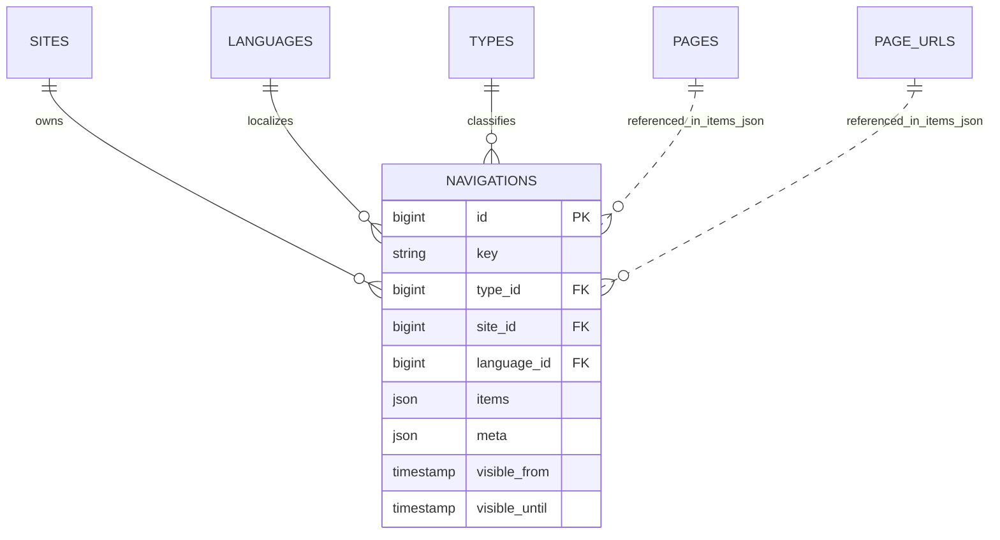

# Navigation

Status: **Available, schema-owning** · Kind: **package** · Tier: **free** · Bundle: **foundation** · Contexts: **admin, frontend, console** · Product group: **Capell Foundation**

This page is the consolidated implementation overview for the Navigation package. It is extracted from the package README, service providers, migrations, config files, routes, resources, models, actions, and the shared Capell ERD notes where available.

## What This Plugin Adds

Navigation adds site and language scoped navigation trees, page navigation fields, sync actions, and frontend loading support.

- Navigation Filament resource.
- Navigation relation manager on sites.
- Page schema extender for navigation placement.
- Navigation item model resolution.
- Actions to add, remove, replicate, and resolve navigation entries.
- Navigation loader support for frontend rendering.

## Developer Notes

Stores navigation items in structured data and uses adapters/registries to connect navigable models without hard-coding page logic everywhere.

- NavigationServiceProvider registers the package.
- Migration creates navigations.
- Model: Navigation.
- Filament resource: NavigationResource.
- Policy: NavigationPolicy.
- Events/listeners handle creation and site replication.

## Operational Notes

Lets editors manage menus for each site and language while keeping page selection tied to Capell records.

- Adds navigations table.
- Adds navigation admin resource and site relation manager.
- Extends page and site admin schemas.
- No explicit public route is registered by this package.
- Adds setup and demo commands.

## Data And Retention

- navigations stores key, type, site, language, items JSON, meta, and visibility windows.
- Navigation items may reference pages and page URLs through JSON.
- Navigations connect to sites, languages, and types.
- Cache key enum indicates navigation cache behaviour.

## Content Graph

Navigation contributes content graph edges from each navigation record to the pages referenced by its nested page items. These edges use `LinksToPage` with strong strength, so impact previews, safer deletes, diagnostics, and graph-aware invalidation can see which menus depend on a page.

## Screenshot Plan

- Navigation admin index.
- Create/edit navigation form.
- Site relation manager for navigations.
- Page form navigation tab.
- Frontend menu output.

## Pitfalls

- Create language/site records before creating scoped navigation.
- Resolve stale page references after deleting pages.
- Clear navigation cache after manual data changes.

## Verification

- Run `vendor/bin/pest packages/navigation/tests` when package tests exist.
- Run the relevant host-app migration or package install flow in a disposable database.
- Open the listed admin or frontend surface and compare it with the screenshot plan.

## Package Manifest

- Composer name: `capell-app/navigation`
- Product group: Capell Foundation
- Kind: package
- Tier: free
- Bundle: foundation
- Contexts: `admin`, `frontend`, `console`
- Requires: `capell-app/core`, `capell-app/admin`, `capell-app/frontend`
- Optional dependencies: None listed.

## Admin Surfaces

- NavigationResource (packages/navigation/src/Filament/Resources/Navigations/NavigationResource.php)
- CreateNavigation (packages/navigation/src/Filament/Resources/Navigations/Pages/CreateNavigation.php)
- EditNavigation (packages/navigation/src/Filament/Resources/Navigations/Pages/EditNavigation.php)
- ListNavigations (packages/navigation/src/Filament/Resources/Navigations/Pages/ListNavigations.php)

## Commands

- `capell:navigation-demo {--sites=} {--languages=}` (packages/navigation/src/Console/Commands/DemoCommand.php)
- `capell:navigation-setup {--sites=}` (packages/navigation/src/Console/Commands/SetupCommand.php)

## Routes And Config

- None proven in this package directory.

## Permissions And Gates

- Policy: NavigationPolicy (packages/navigation/src/Policies/NavigationPolicy.php)

## Migrations

- Migration: create_navigations_table.php

## ERD Excerpt

## Screenshot Automation

Deployment should read [screenshots.json](screenshots.json), install the package with demo data, resolve each admin surface or frontend URL, and write images to `public/docs/screenshots/packages/navigation`.

- Navigation admin index.
- Create/edit navigation form.
- Site relation manager for navigations.
- Page form navigation tab.
- Frontend menu output.
