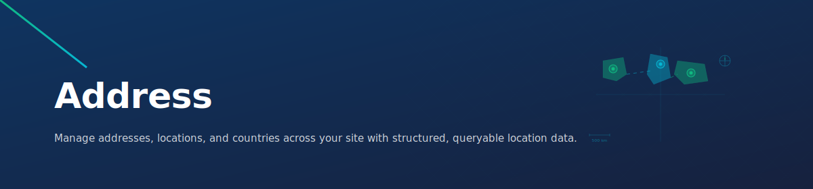

<p align="center">
  <a href="https://capell.app"></a>
</p>

# Capell Address



Country and address management for Capell sites. Ships a `Country` and `Address` model, Filament resources and form components, and runtime relationships that let any `Site` store a primary address.

**[Full documentation →](https://docs.capell.app/packages/address/)**

## Overview

- **Country** and **Address** Filament resources in the admin.
- **Form components** — `CountrySelect` and `AddressSelect` — drop-in inputs for any Filament form.
- **Site schema extender** that adds the address fields to the Site edit form automatically.
- **Runtime relationships** — `Site::address()` and `Site::country()` — registered in the service provider.
- **Factories** for `Country` and `Address` for test and demo use.

## Prerequisites

- `capell-app/admin`

## Installation

```sh
php artisan capell:address-install
```

The installer publishes and runs the `countries` and `addresses` migrations, registers the Filament resources and permissions, and assigns permissions to the default admin role.

Seed demo data:

```sh
php artisan capell:address-demo --sites=1
```

## Using it

Once installed, the Site edit form in the admin shows country and address fields via `SiteSchemaExtender`. No extra configuration is required.

From code, reach the address and country off any site:

```php
$site = Site::find(1);

$address = $site->address;   // Capell\Address\Models\Address
$country = $site->country;   // Capell\Address\Models\Country (resolved through the address)

echo $address->full_address;
echo $country->iso2;
```

## Core concepts

**Address storage on Site.** Rather than adding a foreign key to `sites`, this package stores the `address_id` inside the site's `meta` JSON column. The `Site::address()` relation is resolved at runtime via `Site::resolveRelationUsing(...)`:

- `address()` — `BelongsTo(Address::class, 'meta->address_id')`
- `country()` — `HasOneThrough(Country::class, Address::class)` (so the country flows through the address)

This keeps the core `sites` table untouched while still giving you normal Eloquent ergonomics.

## Database

| Migration                    | Table       |
| ---------------------------- | ----------- |
| `create_countries_table.php` | `countries` |
| `create_addresses_table.php` | `addresses` |

See [docs/address-database.md](docs/address-database.md) for the full column list, casts, and scopes.

## Artisan commands

| Command                  | Purpose                                                        |
| ------------------------ | -------------------------------------------------------------- |
| `capell:address-install` | Publish/run migrations, register resources, assign permissions |
| `capell:address-demo`    | Seed a demo country and address, attach to sites (`--sites=`)  |

- Database reference: [docs/address-database.md](docs/address-database.md) · [docs.capell.app](https://docs.capell.app/packages/address/)
- API reference: [docs/address-api.md](docs/address-api.md)
