# Capell Blog

**Product group:** Capell Foundation
**Tier:** Free

Capell Blog adds article publishing to Capell: article pages, tags, archives, RSS, sitemap integration, and optional Mosaic widgets.



## When to install it

Install Blog when the site needs chronological content: news, guides, press releases, changelogs, events, or editorial articles that should appear in archives and feeds.

## Quick install

```bash
composer require capell-app/blog
php artisan capell:blog-install
php artisan capell:blog-demo
```

Create the default Blog, Archives, and Tags pages for a site:

```bash
php artisan capell:blog-create-pages 1
```

## What appears in the admin

| Area           | What editors can do                                                         |
| -------------- | --------------------------------------------------------------------------- |
| Articles       | Create, edit, tag, publish, and schedule article pages                      |
| Tags           | Manage the tag taxonomy used by articles                                    |
| Pages          | Use generated Blog, Archives, and Tags pages                                |
| Mosaic widgets | Place Article, Related, Archives, and Tags widgets when Mosaic is installed |

## What developers get

- Article page type and schema registration.
- Workspace-aware tags and article records.
- Livewire listing pages for blog index, date archives, and tag views.
- Sitemap entries for articles, archive pages, and tag pages.

## Common commands

| Command                                  | Purpose                                                |
| ---------------------------------------- | ------------------------------------------------------ |
| `php artisan capell:blog-install`        | Install migrations, config, resources, and permissions |
| `php artisan capell:blog-create-pages 1` | Create default blog pages for site `1`                 |
| `php artisan capell:blog-demo`           | Seed demo articles                                     |
| `php artisan capell:blog-setup`          | Setup-only phase used by package installers            |

## Deeper docs

- [Hosted documentation](https://docs.capell.app/packages/foundation/blog/)
- [Database reference](docs/blog-database.md)
- [API reference](docs/blog-api.md)
