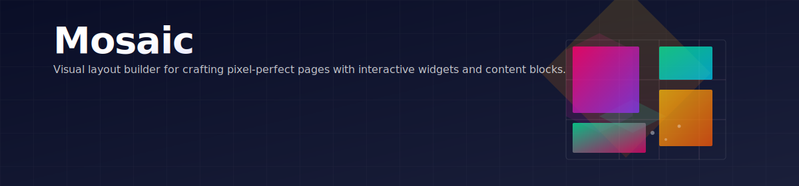

# Capell Mosaic

**Product group:** Capell Foundation
**Tier:** Free

Mosaic is the visual page builder for Capell. It gives editors rows, columns, reusable content, and widgets without asking developers to rebuild a block editor for every project.



## When to install it

Install Mosaic when pages need composed sections instead of one rich text field: hero banners, feature grids, testimonials, media galleries, page lists, CTAs, or reusable content blocks.

## Quick install

```bash
composer require capell-app/mosaic
php artisan capell:mosaic-install
php artisan capell:mosaic-demo
```

The installer publishes migrations and assets, registers Filament resources, and wires the builder components.

## What appears in the admin

| Area        | What editors can do                                             |
| ----------- | --------------------------------------------------------------- |
| Contents    | Manage reusable translatable content blocks                     |
| Widgets     | Create widget instances and connect them to content             |
| Layouts     | Arrange containers and widget positions                         |
| Page editor | Add rows, columns, widgets, translations, and content selectors |

## What developers get

- Auto-discovered widget schemas and views.
- Runtime relationships such as `Page::contents()`, `Page::widgets()`, and `Site::contents()`.
- Workspace-aware content records for draft and publish flows.
- Admin and frontend assets published into the host app.

## Common commands

| Command                                  | Purpose                                                |
| ---------------------------------------- | ------------------------------------------------------ |
| `php artisan capell:mosaic-install`      | Install migrations, resources, permissions, and assets |
| `php artisan capell:mosaic-demo`         | Seed demo layouts and content                          |
| `php artisan capell:mosaic-upgrade`      | Run package upgrade routines after Composer updates    |
| `php artisan capell:hero-demo --sites=1` | Add sample hero content                                |

## Deeper docs

- [Hosted documentation](https://docs.capell.app/packages/foundation/mosaic/)
- [Database reference](docs/mosaic-database.md)
- [API reference](docs/mosaic-api.md)
