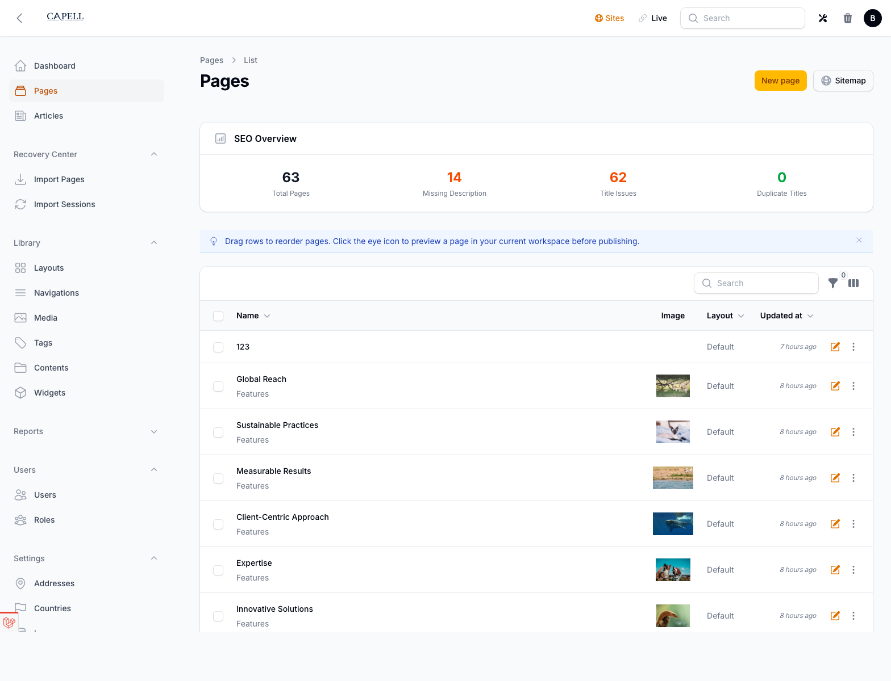

# Capell Workspaces

**Product group:** Capell Publishing Pro
**Tier:** Premium

Workspaces is Capell's editorial workflow package for revisions, scheduling, approvals, and controlled publishing. Editors can group related changes, preview them together, request review, schedule publishing, and roll back versions without pushing half-finished content live.

## When to install it

Install Workspaces when more than one person edits content, when campaigns need staged revisions, or when publishing requires approval checks and release scheduling.

## Editorial workflow coverage

| Capability         | What Workspaces provides                                                                  |
| ------------------ | ----------------------------------------------------------------------------------------- |
| Revisions          | Page revisions, draft copies, immutable published versions, comparisons, and rollback     |
| Scheduling         | Approved workspaces can be scheduled, unscheduled, and published automatically when due   |
| Approvals          | Submit for approval, approve, request changes, reject, review assignments, and history    |
| Editorial workflow | Workspace switcher, preview links, publish checks, activity feed, and stale draft reports |

## Quick install

```bash
composer require capell-app/workspaces
php artisan migrate
php artisan optimize:clear
```

The package registers through Laravel discovery and adds admin, console, and shared providers.

## What appears in the admin

| Area               | What editors can do                                           |
| ------------------ | ------------------------------------------------------------- |
| Revisions          | Save drafts, compare versions, and restore earlier content    |
| Scheduling         | Queue approved workspaces for a future publish time           |
| Approvals          | Submit, approve, request changes, reject, and review history  |
| Editorial workflow | Move between live and draft workspaces, preview, and validate |



## What developers get

- Draftable model support through workspace-aware traits and contracts.
- Copy-on-write publishing, diffing, rebasing, rollback, and scheduled publish actions.
- Publish checks for accessibility, broken links, missing alt text, and SEO metadata.
- Events and notifications for workspace state changes.

## Deeper docs

- [Workspaces overview](docs/workspaces.md)
- [Page drafts and publishing](docs/page-drafts-and-publishing.md)
- [Page creation and approval flow](docs/page-creation-and-approval-flow.md)
- [Extending workspaces](docs/extending-workspaces.md)
- [Draftable contract](docs/workspaces-draftable-contract.md)
