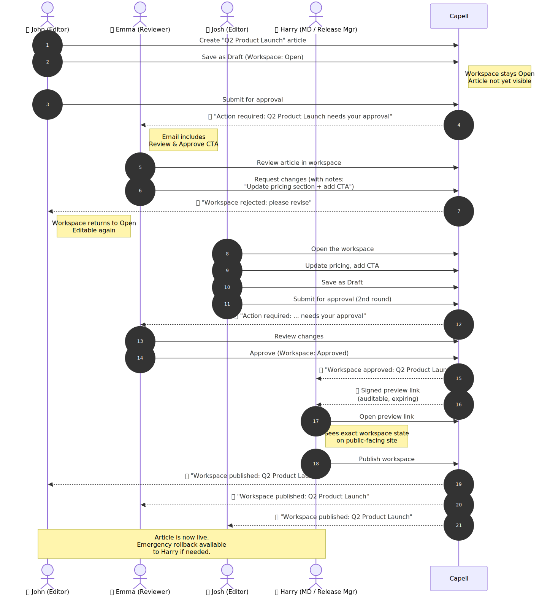

# Page Creation & Approval Flow

End-to-end walkthrough of how a page goes from "draft" to "live", covering the three user roles, the workspace state machine, and the email notifications sent at each transition.

For the underlying data model, see [Workspaces & Versions](workspaces.md). For role/permission details, see [Permissions & Approval](https://docs.capell.app/permissions-and-approval/) (in the Admin package).

---

## Roles

| Role                                              | Permissions                                                                                  | What they can do                                                                  |
| ------------------------------------------------- | -------------------------------------------------------------------------------------------- | --------------------------------------------------------------------------------- |
| **Editor** (`workspace_editor`)                   | `create_workspace`, `update_workspace`, `submit_workspace_for_approval`                      | Create pages, save drafts, submit for approval                                    |
| **Reviewer** (`workspace_reviewer`)               | Editor perms + `approve_workspace`                                                           | Everything an editor can do, plus approve or reject submissions                   |
| **Release Manager** (`workspace_release_manager`) | Reviewer perms + `publish_workspace`, `rollback_workspace`, `publish_outside_release_window` | Everything a reviewer can do, plus publish, schedule, and roll back live versions |

---

## Flow diagram



<details>
<summary>Mermaid source (click to expand)</summary>

Source file: [images/page-creation-flow.mmd](images/page-creation-flow.mmd).

To regenerate the SVGs after editing either diagram source:

```bash
npx -y -p @mermaid-js/mermaid-cli mmdc \
  -i packages/workspaces/docs/images/page-creation-flow.mmd \
  -o packages/workspaces/docs/images/page-creation-flow.svg \
  -b transparent

npx -y -p @mermaid-js/mermaid-cli mmdc \
  -i packages/workspaces/docs/images/approval-example.mmd \
  -o packages/workspaces/docs/images/approval-example.svg \
  -b transparent
```

</details>

---

## Worked example — John, Emma, Josh, Harry

A realistic scenario showing every role, a change request round-trip, and the final MD sign-off via preview link:



1. **John** (Editor) creates the _Q2 Product Launch_ article and clicks **Save as Draft**. The workspace is created in **Open** state — nothing is visible on live.
2. John clicks **Submit for approval**. Workspace transitions **Open → InReview**.
3. **Emma** (Reviewer) receives an email: _"Action required: Q2 Product Launch needs your approval"_, with a **Review & Approve** button.
4. Emma opens the workspace, reviews the article, and decides changes are needed. She clicks **Reject**, entering notes: _"Update pricing section + add CTA"_. Workspace returns to **Open** and is editable again.
5. John (or **Josh**, another editor) is emailed: _"Workspace rejected: please revise"_, with the rejection notes. Josh opens the workspace, updates the pricing section, adds the CTA, and clicks **Save as Draft**.
6. Josh clicks **Submit for approval** again. Workspace transitions **Open → InReview**; Emma gets a fresh approval request.
7. Emma reviews the updated article and clicks **Approve**. Workspace transitions **InReview → Approved**.
8. **Harry** (MD / Release Manager) is emailed: _"Workspace approved: Q2 Product Launch"_. He can open the workspace to inspect it, or use the **Preview** action to mint a **signed, expiring preview URL** that shows the workspace on the public-facing site (see [Workspaces — Preview](workspaces.md#preview)).
9. Harry follows the preview link, walks the site in workspace context (preview pill visible, HTML cache bypassed), and is satisfied.
10. Harry clicks **Publish**. Workspace transitions **Approved → Publishing → Published** (atomic flip). John, Emma, and Josh all receive a _"Workspace published"_ notification.

> **Rollback safety net:** Harry can click **Rollback** on the published workspace at any time to restore the previous live version. Only users with the `rollback_workspace` permission can do this.

---

## Change requests (today vs planned)

**Today.** A reviewer who wants iterative changes uses the **Reject** action with notes. The workspace returns to **Open**, the editor can act on the feedback, and the cycle continues. The audit log captures every submit / reject / approve event on `workspace_approvals`. There is **no separate "Request changes" action** — rejection _is_ the change-request primitive.

**Planned enhancement.** Split the concept so the UX matches editor intent:

| Action              | Meaning                                                                          | Workspace transitions                                                                           |
| ------------------- | -------------------------------------------------------------------------------- | ----------------------------------------------------------------------------------------------- |
| **Request changes** | "Nearly there — here's what to tweak." Expected to be iterated on.               | `InReview → Open`, increments a `review_round` counter on the workspace.                        |
| **Reject**          | "This workspace should not ship." Terminal unless the editor explicitly reopens. | `InReview → Open` and marks the workspace's last approval row as `rejected` (as it does today). |

Scope of the change:

- New `RequestChangesAction` next to `RejectAction` (shares most of the machinery).
- New `WorkspaceApprovalActionEnum::RequestedChanges` value (so the audit trail distinguishes change requests from rejections).
- New email notification key (`request_changes_subject`, `request_changes_intro`, `request_changes_cta`).
- Admin UI: surface review-round count + latest reviewer notes on the workspace header so editors don't need to open the activity log.
- Policy: gated by the existing `approve_workspace` permission (reviewers can do both).

Not in scope until this lands: nothing in the current flow blocks users — rejection already covers iterative feedback; this is a UX clarity upgrade.

---

## Step-by-step

### 1. Editor creates or edits a page

Three entry points — all land in the same **Open** workspace:

| Entry                                                                                                                    | Buttons presented                                              |
| ------------------------------------------------------------------------------------------------------------------------ | -------------------------------------------------------------- |
| **Edit Page form** (`capell/admin` → `Filament/Resources/Pages/Pages/EditPage.php`)                                  | `Save`, `Save as Draft`, `Cancel`                              |
| **Create Page form** (direct URL, `capell/admin` → `Filament/Resources/Pages/Pages/CreatePage.php`)                | `Create`, `Save as Draft`, `Create & create another`, `Cancel` |
| **Create Page modal** from list/edit headers (`capell/admin` → `Filament/Actions/Page/CreatePageAction.php`) | Main submit button + `Save as Draft` footer action             |

**`Save as Draft` vs `Save/Create`:**
Functionally identical — both persist the row to the current workspace. The dedicated button exists to give editors a clearer mental model: "this is a draft, it is not yet published." The success notification swaps to _"Saved as draft. Your changes are not yet published."_ to reinforce that.

No state transition happens on save — the workspace stays in **Open**.

### 2. Editor submits for approval

`Submit for approval` action → workspace transitions `Open → InReview`.

- Editing is locked while in review.
- Optional submission notes are captured and logged to `workspace_approvals`.
- `WorkspaceStateChanged` event fires with `transition: submitted`.

**📧 Emails sent to:** Reviewers + Release Managers
(configured at `capell.workspaces.notifications.recipients.submitted`)

### 3. Reviewer approves or rejects

Two outcomes from **InReview**:

#### Approve

`Approved` action → `InReview → Approved`.

- Approval recorded in `workspace_approvals` (level + optional notes).
- When `level >= required_approval_levels` (default 2, overridable per-workspace via `settings.required_approval_levels`), status flips to Approved.
- `WorkspaceStateChanged` event fires with `transition: approved`.

**📧 Emails sent to:** Editors + Release Managers
(configured at `capell.workspaces.notifications.recipients.approved`)

#### Reject

`Reject` action → `InReview → Open`.

- Rejection notes are **required** and logged.
- Editor can address feedback and resubmit.
- `WorkspaceStateChanged` event fires with `transition: rejected`.

**📧 Emails sent to:** Editors
(configured at `capell.workspaces.notifications.recipients.rejected`)

### 4. Release Manager publishes or schedules

From **Approved**, the release manager has three choices:

#### Publish now

`Publish` action → `Approved → Publishing → Published`.

The `Publisher` runs inside a transaction:

1. Freshness check (workspace must be based on current live version).
2. URL collision check.
3. Release window guard (can bypass with permission).
4. Publish-check pipeline (custom checks).
5. Atomic flip: each registered draftable table runs `UPDATE … SET workspace_id = 0 WHERE workspace_id = $workspace->id`.
6. New `Version` row created and flipped to `is_live = true`.

**📧 Emails sent to:** Editors + Reviewers + Release Managers
(configured at `capell.workspaces.notifications.recipients.published`)

#### Schedule for later

`Schedule` action → `Approved → Scheduled` with a `publish_at` timestamp.

- `PublishScheduledWorkspacesJob` runs on the scheduler; when `publish_at <= now()`, it fires the normal Publisher (respecting release windows and publish checks).
- `Unschedule` action returns the workspace to **Approved**.

#### Rollback (post-publish emergency)

`Rollback` action on a **Published** workspace → restores the previous live version.

- Requires the `rollback_workspace` permission (release manager only).
- A textual reason is required.
- Per-entity rollback also exists for reverting individual rows without touching the whole workspace.

---

## Email notifications reference

All emails are dispatched via the queued `WorkspaceStateNotification` by the `SendWorkspaceStateNotification` listener. The triggering actor is **always excluded** — you will never be notified about your own action.

| Transition             | Default recipient roles                                               | Event `transition` |
| ---------------------- | --------------------------------------------------------------------- | ------------------ |
| Submitted for approval | `workspace_reviewer`, `workspace_release_manager`                     | `submitted`        |
| Approved               | `workspace_editor`, `workspace_release_manager`                       | `approved`         |
| Rejected               | `workspace_editor`                                                    | `rejected`         |
| Published              | `workspace_editor`, `workspace_reviewer`, `workspace_release_manager` | `published`        |
| Abandoned              | _(none by default)_                                                   | `abandoned`        |

**Customization:** Override `config('capell.workspaces.notifications.recipients.<transition>')` with any Spatie role names. Set `capell.workspaces.notifications.enabled` to `false` to disable emails entirely.

**Relevant files:**

- Listener: [SendWorkspaceStateNotification.php](../src/Listeners/SendWorkspaceStateNotification.php)
- Notification: [WorkspaceStateNotification.php](../src/Notifications/WorkspaceStateNotification.php)
- Event: [WorkspaceStateChanged.php](../src/Events/WorkspaceStateChanged.php)
- Default config: `capell/core` → `config/capell.php` under `workspaces.notifications.recipients`
- Mail strings: `capell/admin` → `resources/lang/en/workspace.php` under `mail.*`

---

## Tooltips

Each workflow action carries a tooltip explaining what it does (rendered by Filament on hover). These are keyed under `workspace.actions.*_tooltip` in `capell/admin` → `resources/lang/en/workspace.php`.
